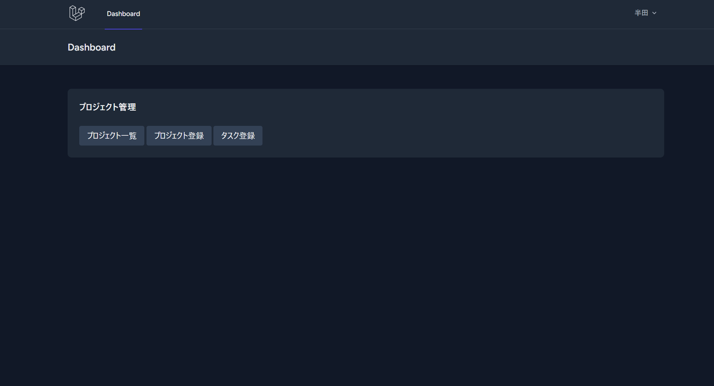
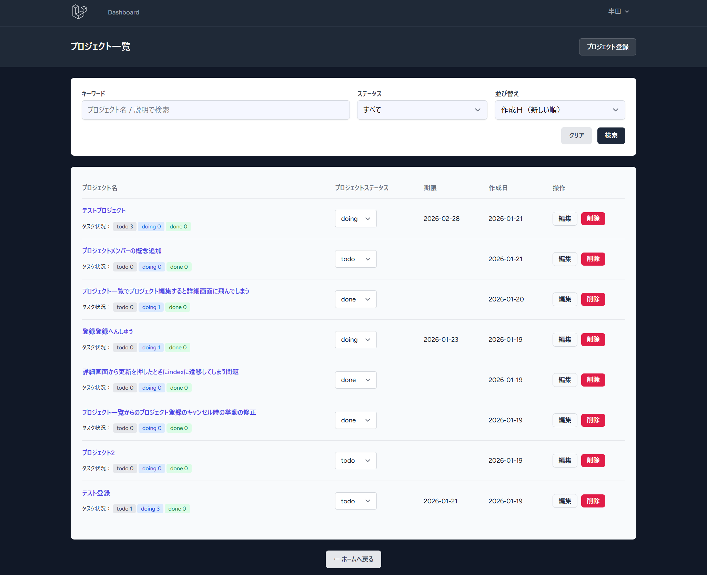
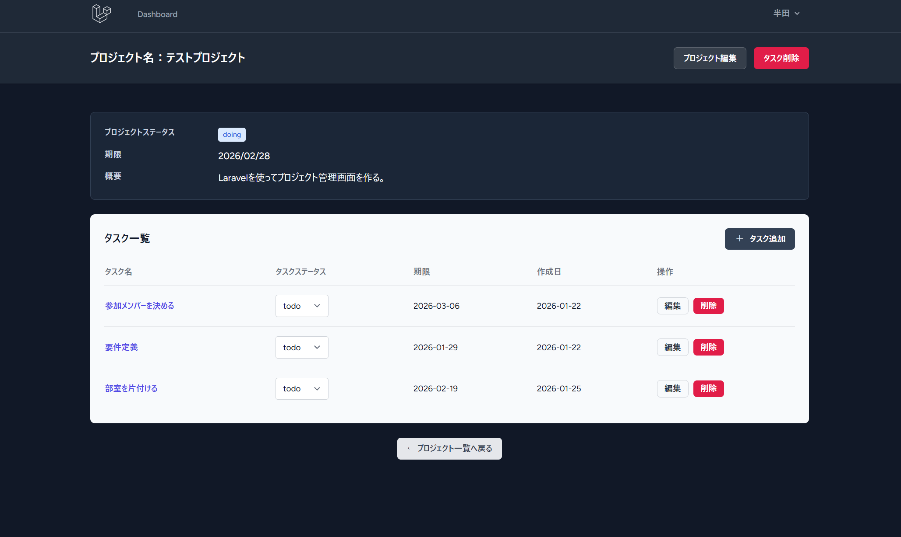
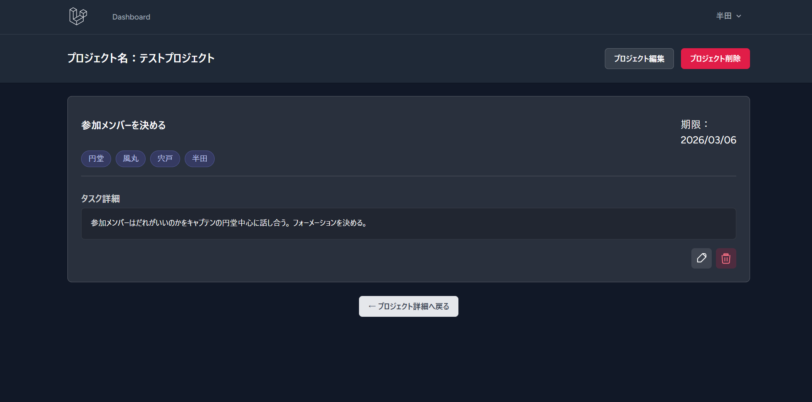

# Project Manager

Laravel 10 を用いて作成した、プロジェクト・タスク管理アプリです。
実務を想定し、CRUD・認証・画面遷移・論理削除などの基本的な設計を重視しています。

## 作成目的

- Laravel（MVC / Resource Routing / FormRequest）の理解
- 実務を想定した CRUD 設計
- UI / UX を意識した画面設計
  

## 使用技術

- PHP 8.2
- Laravel 10
- Laravel Breeze（認証）
- Blade
- Tailwind CSS
- MySQL
  

## 主な機能

### プロジェクト管理
- プロジェクトの登録・一覧・詳細表示
- プロジェクトに紐づくタスクの進捗を色ごとに表示
- キーワード・進捗状態での絞り込み
- 期限日・作成日（それぞれ近い順・遠い順）でのソート機能
- ステータスのリアルタイム変更
- 論理削除（SoftDelete）

### タスク管理
- プロジェクトに紐づくタスクの登録・編集・削除
- タスク削除後は親プロジェクト詳細へリダイレクト
- 担当メンバーの表示
- 論理削除（SoftDelete）

## 画面構成

- ダッシュボード
- プロジェクト一覧
- プロジェクト詳細（タスク一覧）
- プロジェクト登録
- タスク登録 / 編集（共通フォーム）
- タスク詳細

### ダッシュボード

### プロジェクト一覧

### プロジェクト詳細

### タスク詳細

## 設計上の工夫

- create / edit で共通フォームを使用し、重複を排除
- FormRequest によるバリデーション管理
- Route Model Binding を使用し、Controller を簡潔に保つ
- 親（Project）削除時に子（Task）も論理削除
- コミットは機能単位で分割
- 更新/キャンセル時の遷移先の細分化

## これから実装予定・したい機能

- プロジェクト/タスク詳細画面のコメント機能
- ダッシュボードに期限が近いプロジェクトやタスクを表示
- プロフィール編集（画像の追加・個人情報の設定）
- タスク検索/絞り込み機能

## 補足

本プロジェクトは Laravel 10 をベースに構築しています。
フレームワークの仕様については、Laravel公式ドキュメントを参照しています。
https://laravel.com/docs
